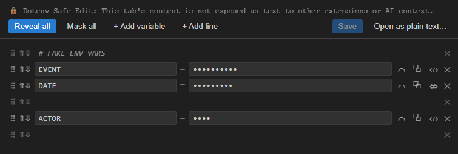
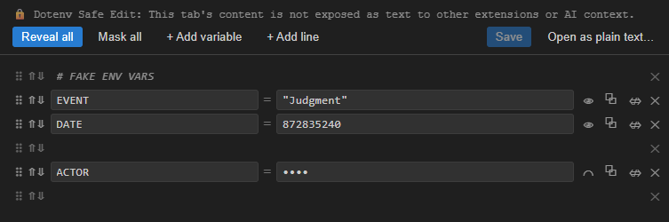

# Dotenv Safe Edit

Opens files matching `*.env`, `*.env.*`, `.env`, or `.env.*` in an isolated
custom editor instead of the normal text editor.

## Why

VS Code's normal text editor turns every open file into a `TextDocument`,
which is exactly what tools like GitHub Copilot Chat's "Ask" mode read as
implicit context (the active editor). If a `.env` file is left open and you
switch to Ask mode, its contents can get pulled into the chat automatically.

Dotenv Safe Edit registers a **non-text custom editor** for `.env` files. The file is
still read from disk to display it, but it never becomes a `TextDocument` and
never shows up as an "active text editor" — so tools that read open
tabs/editors have nothing to read while it's open here.

This does **not** protect against:

* Agents/tools with direct filesystem or shell access (`cat .env`, file-read tools, etc.)
* Anyone using "Open As... > Text Editor" to bypass Dotenv Safe Edit deliberately
* Anything that indexes your workspace on disk directly (e.g. `@workspace`
  style search over files, if it bypasses editor state)

It closes one specific, real hole: forgetting to close the tab before
switching to chat.

## Features

* Works for matching files anywhere on disk, including outside the current workspace
  folder.
* Values masked by default (`type="password"` style inputs)
* Per-row reveal/mask toggle, or reveal/mask all
* Copy a single value to clipboard without revealing it on screen
* Add / edit / delete variables, saved directly to disk
* Comments and blank lines are editable too (free-text lines, auto-prefixed
  with `#` unless left blank), not just read-only passthrough
* Reorder any line (variable or comment/blank) via move up/down buttons or
  drag-and-drop using the handle on the left
* Empty key or value fields are flagged with a red border
* Sticky toolbar (Reveal all / Mask all / +Add variable / +Add line / Save /
  Open as plain text) that stays visible while scrolling through long
  files; the file path is shown in the banner above it
* Save is disabled until there's an actual unsaved change
* Tab only moves between text fields (key/value/comment inputs), not
  through the row buttons
* "Open as Plain Text..." escape hatch when you deliberately want the normal
  editor (e.g. to diff, or to use VS Code's find/replace)
* Bypass per-file: right-click the file → **Open With...** → **Text Editor**
* Wrapping quotes (e.g. `KEY="value"`) get baked into the displayed value.

## Screenshots

### Values masked by default

### Values revealed for editing

## Install

Install Dotenv Safe Edit from the Visual Studio Marketplace, or directly from
the VS Code Extensions view:

1. Open the Extensions view in VS Code.
2. Search for **Dotenv Safe Edit**.
3. Select the extension and click **Install**.

### Manual installation

To build and install the extension manually:

1. `npm install`
2. `npm run package` (runs `tsc` then `vsce package`)

Then install the extension:

1. Right click the `vscode-dotenv-safe-x.y.z.vsix` file → **Install Extension VSIX**.

Or alternatively:

1. VS Code → Extensions view → `...` menu (top right) → **Install from VSIX...**
2. Pick the generated `vscode-dotenv-safe-x.y.z.vsix`

## Uninstall

* Extensions view → Dotenv Safe Edit → gear icon → Uninstall
